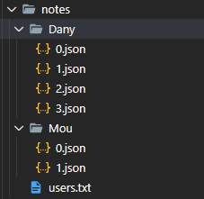

##### José Daniel Fuentes Marra alu0101166247@ull.edu.es
# Informe de la práctica 8
## Aplicación de procesamiento de notas de texto

## Introducción
 
En esta practica se pide crear un especie de aplicación de gestión de notas multi-usuario para ser usada a través de comandos desde la terminal.
## Objetivo
 
El objetivo de esta práctica es crear esta aplicación haciendo uso de 3 herramientas las cuales son:

[Chalk](https://www.npmjs.com/package/chalk): Nos permite cambiar el color de la salida por consola de texto.

[Yargs](https://www.npmjs.com/package/yargs): Nos permite configurar comandos para interactuar con un programa desde la terminal enviándole parámetros.

[API síncrona de Node.js (fs)](https://nodejs.org/dist/latest-v15.x/docs/api/fs.html#fs_synchronous_api): Nos permite leer o escribir archivos desde nuestro programa para guardar o cargar información almacenada en ficheros, entre otras funciones mas avanzadas.

Para el correcto funcionamiento de esta app primero se clona el repositorio y luego se ejecuta:
**npm install** para instalar las dependencias
**npm run start** para compilar y generar los .js
Y para los comandos de Yargs unos ejemplos serian:

Add:
**$node dist/note-app.js add --user="Dany" --title="Red note" --body="This is a red note" --color="red"**

List:
**$node dist/note-app.js list --user="Dany"**

Read:
**$node dist/note-app.js read --user="Dany" --title="Red note"**

Remove:
**$node dist/note-app.js remove --user="Dany" --title="Red note"**

Modify:
**$node dist/note-app.js add --user="Dany" --title="Red note" --body="This is a new red note" --color="red"**

## Contenido 

Para empezar decidí crear 2 clases (Note y User) para poder implementar correctamente el objetivo de la practica que seria tener usuarios y que cada usuario tenga una lista de notas propias las cuales tienen titulo, cuerpo y color cada una.

La clase Note seria la siguiente:

```ts
/**
 * Clase para representar una nota
 */
export class Note {
  /**
   * Constructor de la clase nota
   * @param title Titulo de la nota
   * @param body Cuerpo de la nota
   * @param color Color de la nota
   */
  constructor(
    private title: string,
    private body: string,
    private color: colors) { }

  /**
   * Get del titulo de la nota
   * @returns Titulo de la nota
   */
  public getTitle(): string {
    return this.title;
  }

  /**
   * Set para cambiar el titulo a una nota
   * @param title Nuevo titulo
   */
  public setTitle(title: string): void {
    this.title = title;
  }

  /**
   * Get para el cuerpo de la nota
   * @returns El cuerpo
   */
  public getBody(): string {
    return this.body;
  }

  /**
   * Set para cambiar el cuerpo de la nota
   * @param body Nuevo cuerpo
   */
  public setBody(body: string): void {
    this.body = body;
  }

  /**
   * Get del color de la nota
   * @returns Color de la nota
   */
  public getColor(): colors {
    return this.color;
  }

  /**
   * Set para cambiar el color a una nota
   * @param color Nuevo color
   */
  public setColor(color: colors): void {
    this.color = color;
  }
}
```

Como se puede ver esta clase representa una nota y tiene el titulo de la nota, el cuerpo de la nota y su color. También cuenta con los get y set correspondientes para esos atributos.

Para el manejo de los colores decidí crear un enum el cual contiene los colores disponibles para la aplicación y seria el siguiente:

```ts
export enum colors {
  red = 'Red',
  green = 'Green',
  blue = 'Blue',
  yellow = 'Yellow'}
```

De esta manera el atributo color de la clase Note es de tipo colors que es el enum.

Por otro lado la clase User seria la siguiente:

```ts
/**
 * Clase para representar un Usuario
 */
export class User {
  /**
   * Constructor de la clase User
   * @param name Nombre del usuario
   * @param notes Notas del usuario
   */
  constructor(
        private name: string,
        private notes: Note[]) { }

  /**
   * Get del nombre del usuario
   * @returns Nombre
   */
  public getName(): string {
    return this.name;
  }

  /**
   * Get para las notas del usuario
   * @returns Notas del usuario
   */
  public getNotes(): Note[] {
    return this.notes;
  }

  /**
   * Funcion para agregar una nota al usuario
   * @param note Nueva nota
   * @returns Boolean
   */
  public addNote(note: Note): boolean {
    const index = this.notes.indexOf(note, 0);
    if (index > -1) {
      return false;
    } else {
      this.notes.push(note);
      return true;
    }
  }

  /**
   * Funcion para eliminar una nota al usuario
   * @param note Nota a eliminar
   * @returns Boolean
   */
  public removeNote(note : Note): boolean {
    const index = this.notes.indexOf(note, 0);
    if (index > -1) {
      this.notes.splice(index, 1);
      return true;
    } else {
      return false;
    }
  }
}
```

Esta clase representa un usuario y tiene como atributos el nombre del usuario y un arreglo de notas de tipo Note para almacenar las notas de cada usuario. 

Esta clase también cuenta con los get y set correspondientes pero aparte tiene dos funciones que serian (addNote y removeNote), addNote seria para agregarle notas al usuario cuando se crean y remove para eliminar una nota existente del usuario.

Esta es la estructura y las clases con las que cuenta mi aplicación, ahora pasare a explicar el fichero note-app.ts el cual implementa las 3 herramientas antes mencionadas y hace uso de las dos clases anteriores.

Para empezar implemente los siguientes imports para el uso de las herramientas y clases:

```ts
import * as yargs from 'yargs';
import * as chalk from 'chalk';
import {readFile, writeFile} from 'fs';
import {User} from './user';
import {colors, Note} from './note';
```

Para el manejo de los usuarios y sus notas yo uso un vector de usuarios:

```ts
const users: User[] = [];
```

En este vector cargo al inicio de la ejecución la información de los JSON de los usuarios y sus notas para trabajar en el vector durante la ejecución de los comandos yargs y cuando termino las modificaciones vuelvo a pasar la información del vector actualizado a los JSON correspondientes.

La información de los usuarios y sus notas las guardo con la siguiente estructura:



Existe un directorio con el nombre de cada usuario y dentro todas sus notas en formato JSON. Y aparte de cada directorio de cada usuario uso un archivo de texto que almacena el nombre de cada usuario y la cantidad de notas que tiene el usuario. Este archivo se utiliza para cargar la información inicial al ejecutarse el programa y cargar el vector de usuarios.

La función que carga la información al iniciar el programa es la siguiente:

```ts
/**
 * Funcion que carga en un vector todos los usuarios y sus notas de los JSON
 */
function loadDB() {
  readFile('notes/users.txt', (err, data) => {
    if (err) {
      console.log(chalk.red('Users.txt not found!'));
    } else {
      const usersTxt = data.toString().split(/[' ''\n']/);
      for (let i = 0; i < usersTxt.length; i++) {
        const NUser = new User(usersTxt[i], []);
        for (let j = 0; j < Number(usersTxt[i+1]); j++) {
          readFile('notes/' + usersTxt[i] + '/' + j + '.json', (_err, dat) => {
            const dataTxt = dat.toString().split('\"');
            let k = 1;
            const note = new Note('', '', colors.blue);
            k+=2;
            note.setTitle(dataTxt[k]);
            k+=4;
            note.setBody(dataTxt[k]);
            k+=4;
            if (dataTxt[k] === colors.blue) {
              note.setColor(colors.blue);
            }
            if (dataTxt[k] === colors.green) {
              note.setColor(colors.green);
            }
            if (dataTxt[k] === colors.red) {
              note.setColor(colors.red);
            }
            if (dataTxt[k] === colors.yellow) {
              note.setColor(colors.yellow);
            }
            NUser.addNote(note);
          });
        }
        users.push(NUser);
        i++;
      }
    }
  });
}
```

Lo que hace es leer el archivo donde esta el esquema de usuarios y sus notas mediante la API fs que se pide en la practica y con ese esquema busca el directorio de cada usuario y carga sus notas de los JSON y almacena toda esa información en el vector users antes mencionado.

Luego de eso la aplicación esta lista para recibir el comando del yargs que el usuario le mande y procesarlo.

A continuación explicare los comandos que implemente para el uso de Yargs que son:

**Comando ADD:**
```ts
/**
 * Add command
 */
yargs.command({
  command: 'add',
  describe: 'Add a new note',
  builder: {
    user: {
      describe: 'Note User',
      demandOption: true,
      type: 'string',
    },
    title: {
      describe: 'Note Title',
      demandOption: true,
      type: 'string',
    },
    body: {
      describe: 'Note Body',
      demandOption: true,
      type: 'string',
    },
    color: {
      describe: 'Note Color',
      demandOption: true,
      type: 'string',
    },
  },
  handler(argv) {
    let Uexist: boolean = false;
    let Nexist: boolean = false;
    if (typeof argv.user === 'string') {
      for (let i = 0; i < users.length; i++) {
        if (argv.user === users[i].getName()) {
          Uexist = true;
          if (typeof argv.title === 'string') {
            for (let j = 0; j < users[i].getNotes().length; j++) {
              if (argv.title === users[i].getNotes()[j].getTitle()) {
                Nexist = true;
              }
            }
          }
        }
      }
      if (!Uexist) {
        const newUser = new User(argv.user, []);
        if (typeof argv.title === 'string') {
          const title: string = argv.title;
          if (typeof argv.body === 'string') {
            const body: string = argv.body;
            if (typeof argv.color === 'string') {
              if (argv.color === 'blue') {
                const note = new Note(title, body, colors.blue);
                newUser.addNote(note);
                users.push(newUser);
              }
              if (argv.color === 'green') {
                const note = new Note(title, body, colors.green);
                newUser.addNote(note);
                users.push(newUser);
              }
              if (argv.color === 'red') {
                const note = new Note(title, body, colors.red);
                newUser.addNote(note);
                users.push(newUser);
              }
              if (argv.color === 'yellow') {
                const note = new Note(title, body, colors.yellow);
                newUser.addNote(note);
                users.push(newUser);
              }
            }
          }
        }
      }
      if (Nexist) {
        console.log(chalk.red('Note title taken!'));
      } else {
        if (Uexist) {
          if (typeof argv.title === 'string') {
            const title: string = argv.title;
            if (typeof argv.body === 'string') {
              const body: string = argv.body;
              if (typeof argv.color === 'string') {
                const note = new Note(title, body, colors.blue);
                if (argv.color === 'green') {
                  note.setColor(colors.green);
                }
                if (argv.color === 'red') {
                  note.setColor(colors.red);
                }
                if (argv.color === 'yellow') {
                  note.setColor(colors.yellow);
                }
                for (let k = 0; k < users.length; k++) {
                  if (argv.user === users[k].getName()) {
                    users[k].addNote(note);
                  }
                }
              }
            }
          }
        }
        console.log(chalk.green('New note added!'));
        saveData(argv.user);
      }
    }
  },
});
```

Este comando recibe 4 parámetros de la linea de comandos que son: user, title, body y color. 

Lo que hace es buscar al usuario en el vector users y cuando lo encuentra revisa sus notas para ver si ya existe y en caso negativo crea una nota nueva con los datos que el usuario paso desde la linea de comandos y le agrega la nota a ese usuario en el vector users. Véase que los console.log están haciendo uso del chalk para mostrar por pantalla los mensajes en los colores correspondientes dependiendo si fallo o no el proceso. En caso de no encontrar el usuario crea uno nuevo ya que se asume que es un usuario nuevo. Y si ya el usuario existe y la nota también se notifica por consola en rojo que no se puede agregar esa nota porque ya existe.

Luego de hacer las modificaciones necesarias en el vector users se llama la función saveData(user):

```ts
/**
 * Funcion que actualiza el JSON del usuario modificado
 * @param user Usuario
 */
function saveData(user: string) {
  for (let i = 0; i < users.length; i++) {
    if (user === users[i].getName()) {
      const shell = require('shelljs');
      const fs = require('fs');
      const dir = 'notes/' + users[i].getName();
      if (fs.existsSync(dir)) {
        shell.rm('-r', 'notes/' + users[i].getName());
      }
      shell.mkdir('-p', 'notes/' + users[i].getName());
      for (let j = 0; j < users[i].getNotes().length; j++) {
        writeFile('notes/' + user + '/' + j + '.json', jsonFormat(users[i].getNotes()[j]), (err) => {
          if (err) {
            console.log(chalk.red('ERROR'));
          }
        });
      }
      writeFile('notes/users.txt', saveUsersFormat(), (err) => {
        if (err) {
          console.log(chalk.red('ERROR'));
        }
      });
    }
  }
}
```

Esta función hace uso de dos funciones mas que son saveUsersFormat() y jsonFormat(note) que serian:

```ts
/**
 * Funcion para dar formato JSON a una nota
 * @param note Nota a dar formato
 * @returns String con la nota en formato JSON
 */
function jsonFormat(note: Note): string {
  let output: string = '';
  output += '{\n';
  output += '   \"Title\": \"' + note.getTitle() + '\",\n';
  output += '   \"Body\": \"' + note.getBody() + '\",\n';
  output += '   \"Color\": \"' + note.getColor() + '\"\n';
  output += '}\n';
  return output;
}

/**
 * Funcion que guarda un registro con los usuarios existentes
 * @returns String con el formato del registro
 */
function saveUsersFormat(): string {
  let output: string = '';
  for (let i = 0; i < users.length; i++) {
    if (i === users.length-1) {
      output += users[i].getName() + ' ' + users[i].getNotes().length;
    } else {
      output += users[i].getName() + ' ' + users[i].getNotes().length + '\n';
    }
  }
  return output;
}
```

En resumen estas 3 funciones lo que hacen es actualizar el fichero users donde se almacena el esquema de usuarios y la cantidad de notas que tienen y según eso modifica los JSON del usuario que fue modificado actualizándolos según el vector users antes modificado en el comando yargs.

**Comando List:**
```ts
/**
 * List Command
 */
yargs.command({
  command: 'list',
  describe: 'List user notes',
  builder: {
    user: {
      describe: 'User',
      demandOption: true,
      type: 'string',
    },
  },
  handler(argv) {
    if (typeof argv.user === 'string') {
      let flag: boolean = false;
      for (let i = 0; i < users.length; i++) {
        if (argv.user === users[i].getName()) {
          flag = true;
          console.log(chalk.green('Your notes:'));
          printNotes(users[i]);
        }
      }
      if (!flag) {
        console.log(chalk.red('User not found'));
      }
    }
  },
});
```

Este comando busca el usuario y lista sus notas en consola haciendo uso de la función printNotes(user):

```ts
/**
 * Funcion que muestra en pantalla las notas de un usuario
 * @param user Usuario
 */
function printNotes(user: User) {
  const notes: Note[] = user.getNotes();
  for (let i = 0; i < notes.length; i++) {
    if (notes[i].getColor() === colors.blue) {
      console.log(chalk.blue(notes[i].getTitle()));
    }
    if (notes[i].getColor() === colors.green) {
      console.log(chalk.green(notes[i].getTitle()));
    }
    if (notes[i].getColor() === colors.red) {
      console.log(chalk.red(notes[i].getTitle()));
    }
    if (notes[i].getColor() === colors.yellow) {
      console.log(chalk.yellow(notes[i].getTitle()));
    }
  }
}
```

Esta función muestra en pantalla las notas del usuario en el color correspondiente de cada nota haciendo uso de chalk.

**Comando Modify:**

```ts
/**
 * Modify command
 */
yargs.command({
  command: 'modify',
  describe: 'Modify a note',
  builder: {
    user: {
      describe: 'Note User',
      demandOption: true,
      type: 'string',
    },
    title: {
      describe: 'Note Title',
      demandOption: true,
      type: 'string',
    },
    body: {
      describe: 'Note Body',
      demandOption: true,
      type: 'string',
    },
    color: {
      describe: 'Note Color',
      demandOption: true,
      type: 'string',
    },
  },
  handler(argv) {
    let Uexist: boolean = false;
    let Nexist: boolean = false;
    if (typeof argv.user === 'string') {
      if (typeof argv.title === 'string') {
        if (typeof argv.body === 'string') {
          if (typeof argv.color === 'string') {
            for (let i = 0; i < users.length; i++) {
              if (argv.user === users[i].getName()) {
                Uexist = true;
                for (let j = 0; j < users[i].getNotes().length; j++) {
                  if (argv.title === users[i].getNotes()[j].getTitle()) {
                    Nexist = true;
                    // logic
                    const note = new Note(argv.title, argv.body, colors.blue);
                    if (argv.color === 'green') {
                      note.setColor(colors.green);
                    }
                    if (argv.color === 'red') {
                      note.setColor(colors.red);
                    }
                    if (argv.color === 'yellow') {
                      note.setColor(colors.yellow);
                    }
                    users[i].removeNote(users[i].getNotes()[j]);
                    users[i].addNote(note);
                  }
                }
              }
            }
            if (!Uexist) {
              console.log(chalk.red('User not found'));
            } else {
              if (!Nexist) {
                console.log(chalk.red('Note not found'));
              } else {
                console.log(chalk.green('Updated note!'));
                saveData(argv.user);
              }
            }
          }
        }
      }
    }
  },
});
```

Al igual que add este comando busca el usuario y si existe busca la nota y si existe la modifica y la guarda. En caso contrario muestra en rojo un error.

**Comando Remove:**

```ts
/**
 * remove Command
 */
yargs.command({
  command: 'remove',
  describe: 'Remove note',
  builder: {
    user: {
      describe: 'User',
      demandOption: true,
      type: 'string',
    },
    title: {
      describe: 'Note Title',
      demandOption: true,
      type: 'string',
    },
  },
  handler(argv) {
    if (typeof argv.user === 'string') {
      let flag: boolean = false;
      for (let i = 0; i < users.length; i++) {
        if (argv.user === users[i].getName()) {
          if (typeof argv.title === 'string') {
            for (let j = 0; j < users[i].getNotes().length; j++) {
              if (argv.title === users[i].getNotes()[j].getTitle()) {
                users[i].removeNote(users[i].getNotes()[j]);
                flag = true;
                console.log(chalk.green('Note removed!'));
              }
            }
          }
        }
      }
      if (!flag) {
        console.log(chalk.red('User or Note not found'));
      }
      saveData(argv.user);
    }
  },
});
```

De igual forma busca al usuario y la nota y si existe la elimina y actualiza el vector y los JSON correspondientes. Si no existe da error en rojo.

**Comando Read:**
```ts
/**
 * Read Command
 */
yargs.command({
  command: 'read',
  describe: 'Read note',
  builder: {
    user: {
      describe: 'User',
      demandOption: true,
      type: 'string',
    },
    title: {
      describe: 'Note Title',
      demandOption: true,
      type: 'string',
    },
  },
  handler(argv) {
    if (typeof argv.user === 'string') {
      let Nexist: boolean = false;
      for (let i = 0; i < users.length; i++) {
        if (argv.user === users[i].getName()) {
          if (typeof argv.title === 'string') {
            for (let j = 0; j < users[i].getNotes().length; j++) {
              if (argv.title === users[i].getNotes()[j].getTitle()) {
                Nexist = true;
                if (users[i].getNotes()[j].getColor() === colors.blue) {
                  console.log(chalk.blue(users[i].getNotes()[j].getTitle()));
                  console.log(chalk.blue(users[i].getNotes()[j].getBody()));
                }
                if (users[i].getNotes()[j].getColor() === colors.green) {
                  console.log(chalk.green(users[i].getNotes()[j].getTitle()));
                  console.log(chalk.green(users[i].getNotes()[j].getBody()));
                }
                if (users[i].getNotes()[j].getColor() === colors.red) {
                  console.log(chalk.red(users[i].getNotes()[j].getTitle()));
                  console.log(chalk.red(users[i].getNotes()[j].getBody()));
                }
                if (users[i].getNotes()[j].getColor() === colors.yellow) {
                  console.log(chalk.yellow(users[i].getNotes()[j].getTitle()));
                  console.log(chalk.yellow(users[i].getNotes()[j].getBody()));
                }
              }
            }
          }
        }
      }
      if (!Nexist) {
        console.log(chalk.red('Note not found'));
      }
    }
  },
});
```

Y para finalizar el Read que busca el usuario y la nota y si existe la muestra en pantalla con los colores correspondientes y si no da error en rojo.

## Conclusión
 
En conclusión esta practica enseña a trabajar con estas herramientas que a mi parecer me parecieron muy importantes, sobre todo la API fs para poder tener una especie de base de datos y que nuestro programa tenga datos para trabajar sin tenerlos cargados en el código y que los cambios que se hagan durante la ejecución no se pierdan al terminar el programa. De igual forma el Yargs me pareció una excelente herramienta para poder interactuar con el programa desde la terminal y pasar parámetros sin necesidad de hacer menús ni interfaces gráficas.
 
## Bibliografía

* [Guión de la Práctica](https://ull-esit-inf-dsi-2021.github.io/prct08-filesystem-notes-app/)
* [Chalk](https://www.npmjs.com/package/chalk)
* [Yargs](https://www.npmjs.com/package/yargs)
* [API síncrona de Node.js (fs)](https://nodejs.org/dist/latest-v15.x/docs/api/fs.html#fs_synchronous_api)
